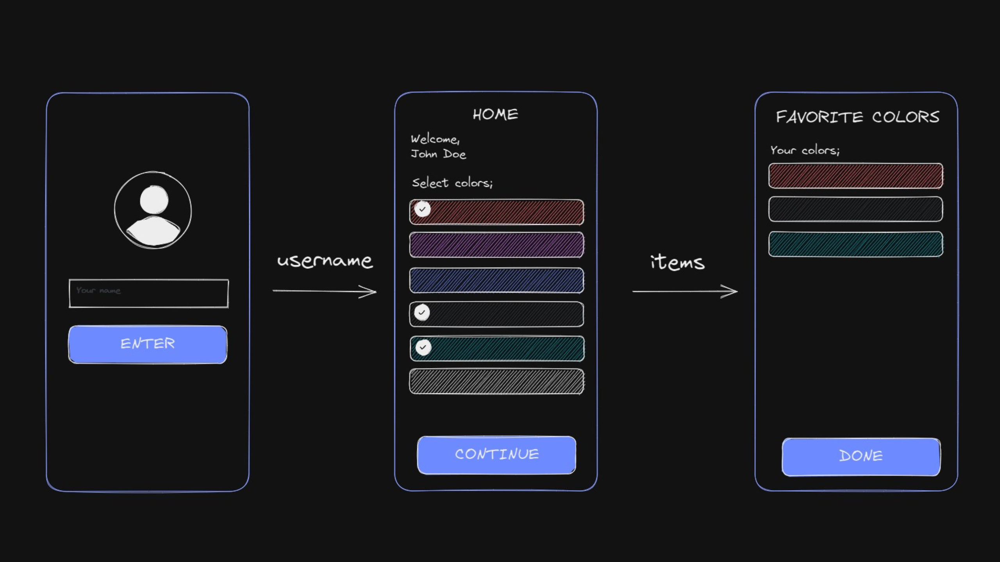

## How to navigate and pass params between pages with React Navigation?


### 📽️ YouTube Tutorial
https://youtu.be/kyQ2wEqymCw

### 📖Read blog post about the video
https://reactnativespace.com/tutorials/navigating-and-passing-params-between-screens-in-react-navigation

### 🔥This video answers following questions;
- ✅How to install react navigation on react native?
- ✅How to navigate and change screens on react native?
- ✅How to pass params between screens on react native?

### :blue_book: Installation
Clone the repo to your directory and install the packages through npm using:
```
npm install
```

### :microscope: Run
Run the project with Metro Bundler
```
npx expo start
```


### 👇 Follow me;
- https://reactnativespace.com
- https://github.com/reactnativespace
- https://twitter.com/reactnativespc
- https://instagram.com/reactnativespace
- https://www.tiktok.com/@reactnativespace
